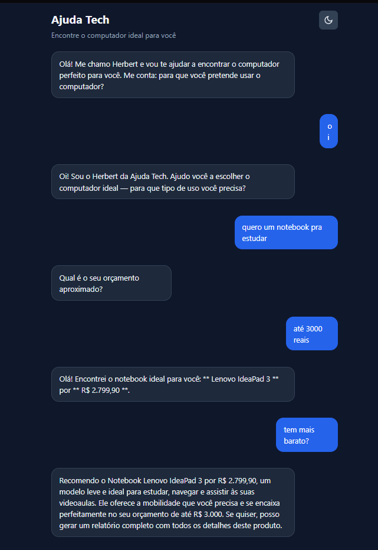

# Ajuda Tech — Assistente Inteligente para Compra de Computadores

# Módulo 2 — Evolução do Projeto com LangGraph

> Documento de análise e planejamento para discussão em grupo.
> Criado em: 2026-07-16

Trabalho módulo 2 com LangGraph

Grupo Dupla
Gisele Tavares
Wagner Sousa

Plano:
[docs/MODULO2_LANGGRAPH_EVOLUCAO.md](docs/MODULO2_LANGGRAPH_EVOLUCAO.md)

Slides:
https://gamma.app/docs/Ajuda-Tech-Problema-e-Solucao-r9t5jfg1cwkiv0e

Repositório:
https://github.com/SCTECH-ATIVIDADES/ajuda.tech


## Integrantes

- Wagner Sousa
- Rafael Santos
- Rafael
- Gisele Tavares
- Luan Rodrigues

## Links

- [Apresentação (Gamma)](https://gamma.app/docs/Untitled-gqu51wdlkr5cbnw?mode=doc)
- [Repositório](https://github.com/SCTECH-ATIVIDADES/ajuda.tech)
- [Vídeo explicativo](https://www.youtube.com/watch?v=z0OYyr210F8)

---

## 1. Problema

Muitas pessoas têm dificuldade em escolher um computador porque não entendem as especificações técnicas. Elas precisam de ajuda para traduzir suas necessidades reais (estudar, trabalhar, jogar) em uma compra adequada ao seu orçamento.

## 2. Objetivo do Agente

O **Herbert** é um agente conversacional que conduz o usuário em uma coleta guiada de informações e recomenda o computador ideal (notebook ou desktop) com base em um catálogo de produtos reais.

- **Entrada:** mensagem do usuário descrevendo o que precisa
- **Saída:** recomendação personalizada de produto do catálogo + relatório em Markdown

## 3. Fluxo com LangGraph

O agente usa `StateGraph` com estado tipado, roteamento condicional, fan-out para consultas independentes ao catálogo e fan-in dos resultados:

```
START → classify_msg → [greet | gather_needs | prepare_catalog]
                         ↓          ↓
                       END       respond
                                      ↑
prepare_catalog → Send → catalog_worker → consolidate_catalog
                                      ↓
                                 recommend → report → respond → END
```

`gather_needs` segue para `prepare_catalog` quando propósito e orçamento existem; caso contrário, segue para `respond`. `extract_context` existe em `nodes.py`, mas não faz parte do grafo atual.

### Nós do grafo

| Nó | Função |
|----|--------|
| `classify_msg` | Classifica a intenção do usuário |
| `greet` | Responde cumprimentos |
| `gather_needs` | Extrai e preserva necessidades do usuário |
| `prepare_catalog` | Cria trabalhos para categorias notebook e desktop |
| `catalog_worker` | Consulta uma categoria do catálogo por ramo |
| `consolidate_catalog` | Consolida produtos e registra falhas parciais |
| `recommend` | Gera recomendação com catálogo consolidado |
| `report` | Gera relatório estruturado em Markdown |
| `respond` | Monta resposta final ou pergunta por dados faltantes |

### Estado compartilhado

```python
class AgentState(TypedDict, total=False):
    messages: Annotated[list, add_messages]
    user_needs: dict[str, object]
    products_found: list[Product]
    catalog_jobs: list[CatalogJob]
    branch_job: CatalogJob
    catalog_results: Annotated[list[CatalogBranchResult], add]
    errors: Annotated[list[str], add]
    stage: str
    recommendation: str
    report: str
    classified_intent: str
```

`catalog_results` e `errors` usam reducers para agregar resultados dos ramos. Falha em um `catalog_worker` vira resultado de erro e não impede consolidação dos demais ramos.

## 4. Ferramentas Integradas

O agente utiliza **3 ferramentas** (tools) registradas via LangChain `@tool`:

| Tool | Descrição |
|------|-----------|
| `buscar_produtos` | Lê o catálogo `produtos.json` e filtra por categoria e orçamento máximo |
| `comparar_produtos` | Compara especificações de dois produtos pelo ID |
| `gerar_relatorio` | Gera relatório em Markdown com nome, preço, specs e justificativa |

`buscar_produtos` é chamada pelos ramos `catalog_worker`; `comparar_produtos` é chamada por `compare_catalog_products`; `gerar_relatorio` é chamada por `report`.

### Integração externa de leitura

Catálogo externo opcional é configurado por `CATALOG_API_URL` e consultado via `GET`, com timeout de 5s e até 2 retries para timeout, conexão e HTTP 5xx. Respostas aceitas são lista JSON ou objeto com `produtos` lista. Cada produto passa validação de schema antes de entrar em qualquer prompt.

Sem URL/credencial/serviço real, evidência externa permanece **BLOCKED**; fluxo usa catálogo `produtos.json`. Se integração configurada falhar, usa fallback local e marca `origem: local_fallback`. Integração é somente leitura, sem ações destrutivas.

Variáveis opcionais: `CATALOG_API_URL`, `CATALOG_TIMEOUT`.

## 5. Memória e Contexto

- Histórico e necessidades estruturadas ficam na sessão Django por até 24 horas; recarregar página preserva conversa.
- Histórico retém no máximo 50 entradas; cada chamada LLM recebe apenas últimas 20 mensagens.
- Mensagem excedendo 4.000 caracteres é rejeitada.
- Nova conversa usa `POST /new/` e limpa sessão explicitamente.
- `thread_id`, `run_id` e `recovered_context` ficam separados no estado do agente; não há checkpointer externo.
- Sessão expirada inicia contexto vazio. Não são armazenados segredos ou dados pessoais sensíveis.
- Falha de persistência é registrada e retorna erro, sem confirmar memória como salva.
- O LangGraph usa `Annotated` e reducers para acumular mensagens, resultados e erros.

## 6. Segurança

- Chaves de API ficam apenas em `.env` (excluído do Git via `.gitignore`)
- `.env.example` contém somente valores locais/documentais; chaves reais não são versionadas
- Nenhuma credencial versionada no repositório
- Proteção CSRF em todos os formulários Django
- Não são coletados dados pessoais sensíveis
- Produção exige `DEBUG=False`, `SECRET_KEY` não padrão e `LLM_API_KEY`; cookies, SSL redirect, HSTS e nosniff ficam protegidos.
- Endpoints de mensagem aceitam JSON objeto com `message` não vazio até 4.000 caracteres; limite local: 10 requisições por sessão a cada 60 segundos, rejeitadas antes da IA.
- Agente usa somente ferramentas de leitura (`buscar_produtos`, `comparar_produtos`, `gerar_relatorio`); não executa ações destrutivas nem escolhe ferramentas dinamicamente.

### Matriz de ameaças — Spec 004

| Ameaça | Controle | Teste/evidência | Status |
|---|---|---|---|
| Prompt injection/vazamento | Dados não confiáveis delimitados; recusa local sem prompt, segredo ou raciocínio | `chat/tests/test_views.py`, `test_prompts.py`, `test_agent_nodes.py` | DONE |
| Payload grande/malformado | JSON objeto, tipos, conteúdo e limites de request/mensagem | `chat/tests/test_views.py` | DONE |
| Abuso/rate limit | 10 mensagens/minuto por sessão antes de LLM/grafo; resposta 429 | `chat/tests/test_limits.py` | DONE |
| Segredos/configuração | Ambiente; produção falha com segredo/chave ausente ou padrão | `ajuda_tech/settings.py`, `python3 manage.py check --deploy` | DONE |
| Tool indevida/catálogo hostil | Whitelist read-only, schema, tipos, limites e escaping | `chat/tests/test_agent_tools.py`, `test_catalog_integration.py` | DONE |
| CSRF | `CsrfViewMiddleware`, token de template e AJAX | `chat/tests/test_views.py` | DONE |

Autonomia fica limitada pelo grafo fixo: entrada do usuário não escolhe ferramentas, URLs ou ações; recomendação depende do fluxo e catálogo configurados.

## 7. Matriz de rastreabilidade

| Critério | Implementação | Teste/evidência | Status |
|---|---|---|---|
| Agente conversacional | `chat/agent/graph.py` | `chat/tests/test_agent_graph.py` | DONE |
| Estado tipado | `chat/agent/state.py` | `chat/tests/test_agent_graph.py` | DONE |
| Roteamento condicional | `chat/agent/graph.py` | `test_agent_graph.py` | DONE |
| Fan-out/fan-in | `chat/agent/graph.py` | `test_agent_graph.py` | DONE |
| Catálogo local | `produtos.json`, `tools.py` | `test_agent_tools.py` | DONE |
| Catálogo externo opcional | `chat/agent/tools.py` | `test_catalog_integration.py` | DONE |
| Memória de sessão | `chat/views.py` | `test_acceptance.py`, `test_limits.py` | DONE |
| Limites de entrada | `chat/views.py` | `test_views.py`, `test_limits.py` | DONE |
| Proteção contra injection | `chat/views.py`, `prompts.py` | `test_views.py`, `test_prompts.py` | DONE |
| CSRF | Django middleware/endpoints | `test_views.py` | DONE |
| Resiliência do LLM | `chat/services.py` | `test_services.py` | DONE |
| Observabilidade | `chat/observability.py` | `test_observability.py` | DONE |
| Contrato frontend | `chatApi.js`, `chatApp.js` | `chatApi*.test.js`, `chatApp.test.js` | DONE |
| Cobertura automatizada | `.github/workflows/ci.yml` | `evidence/006-qa-com-ia/risk-matrix.md` | DONE |
| Serviço externo real e vídeo | fora do repositório | `evidence/006-qa-com-ia/risk-matrix.md` | BLOCKED |

## 8. Como Executar

### Pré-requisitos
- Python 3.12+
- Chave de API do [OpenRouter](https://openrouter.ai)

### Instalação

```bash
git clone https://github.com/SCTECH-ATIVIDADES/ajuda.tech.git
cd ajuda.tech
python -m venv venv
source venv/bin/activate
python -m pip install -r requirements.txt
cp .env.example .env   # edite com sua LLM_API_KEY
python manage.py migrate
python manage.py runserver
```

Acesse: `http://localhost:8000`

### Com Docker

```bash
docker compose up --build
```

Acesse: `http://localhost:8001`

### Testes

```bash
pytest              # backend
npm test            # frontend
```

### Automação local com n8n

```bash
cp .env.example .env
openssl rand -hex 32
# defina AUTOMATION_WEBHOOK_SECRET e N8N_ENCRYPTION_KEY com valores gerados

docker compose up --build -d
```

Abra `http://localhost:5678`, importe `n8n/workflows/ajuda-tech-webhook.json`, defina workflow como ativo e use URL de produção `/webhook/ajuda-tech`. n8n valida `event_id`/`message`, assina payload HMAC-SHA256 e chama `http://app:8000/automation/webhook/`; app rejeita assinatura inválida e duplicatas. Saída visível: resposta JSON da execução n8n. Workflow local não publica HTTPS.

## 9. Exemplo de Entrada e Saída

Veja [docs/exemplos_execucao.md](docs/exemplos_execucao.md) para exemplos detalhados de conversas com o agente.

**Resumo rápido:**

```
Usuário: oi
Herbert: Olá! Me chamo Herbert e vou te ajudar a encontrar o computador
perfeito para você. Me conta: para que você pretende usar o computador?

Usuário: quero um notebook pra estudar
Herbert: Ótimo! E qual é o seu orçamento aproximado?

Usuário: até 3000 reais
Herbert: Com R$ 3.000 você consegue um notebook ótimo para estudos!
O Samsung Book i3 é uma ótima opção — processador Intel Core i3,
8 GB de memória e tela de 15.6". Perfeito para navegar, usar o
Office e assistir aulas. Ele custa R$ 2.799,00 e vai atender
muito bem o que você precisa.
```



## 10. Decisões Tomadas

- **LangGraph sobre abordagem procedural:** permite visualizar o fluxo do agente como um grafo
- **OpenRouter como provedor:** permite testar diferentes modelos LLM sem trocar o código
- **Catálogo JSON local:** produto simples, sem necessidade de banco de dados para o catálogo
- **Sessão Django para memória:** mantém dados apenas durante a sessão do usuário
- **Fan-out/fan-in do catálogo:** consulta categorias em ramos independentes e preserva resultados parciais

## 11. Limitações

- **Limite de requests:** a conta free tier do OpenRouter permite ~50 requests/dia
- **Qualidade do modelo:** modelos gratuitos podem expor raciocínio interno (chain-of-thought), que é filtrado pelo código
- **Simplicidade do catálogo:** apenas 12 produtos; em produção seria necessário um banco de dados
- **Sem persistência entre sessões:** ao fechar o navegador, o histórico é perdido
- **Safety filters:** alguns modelos retornam respostas bloqueadas por filtros de segurança; o código trata esses casos

## 12. Estrutura do Projeto

```shell
ajuda.tech/
├── ajuda_tech/          # Configurações Django
├── chat/
│   ├── agent/
│   │   ├── graph.py     # Grafo LangGraph (StateGraph + nós + edges)
│   │   ├── nodes.py     # Funções de cada nó do grafo
│   │   ├── state.py     # Estado tipado (TypedDict)
│   │   └── tools.py     # Ferramentas do catálogo e relatório
│   ├── static/chat/     # Frontend (JS modular + CSS)
│   ├── templates/chat/  # Template Django
│   ├── tests/           # Testes backend (pytest)
│   ├── prompts.py       # System Prompts do agente
│   ├── services.py      # Cliente OpenRouter
│   ├── views.py         # Endpoints Django
│   └── urls.py           # Rotas
├── core/                # Landing page
├── docs/                # Documentação do projeto
├── produtos.json        # Catálogo de produtos (12 itens)
├── Dockerfile
├── docker-compose.yml
├── .env.example
└── README.md
```
