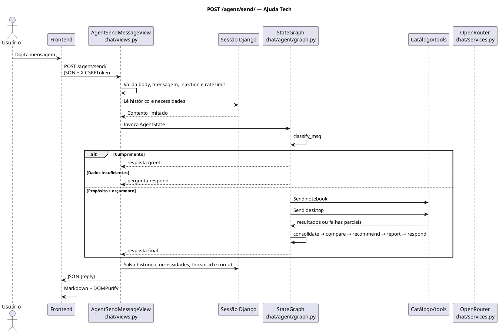

# Diagrama de Sequência — Fluxo Principal

Estado atual: chat sem login, sessão Django assinada, sem banco de conversas e sem checkpointer externo.

## Limites e falhas

- Corpo: 8.192 bytes; mensagem: 4.000 caracteres.
- Histórico: 50 entradas; janela enviada ao LLM: 20 mensagens.
- Rate limit: 10 requisições por sessão em 60 segundos; bloqueio ocorre antes do grafo/LLM.
- Timeout, conexão e HTTP 5xx do LLM/catálogo têm retry limitado. Falha de catálogo não derruba outro ramo.
- `/new/` limpa sessão via `POST`. GET `/` não limpa histórico.
- Webhook `/automation/webhook/` é fluxo separado: HMAC, validação e idempotência.

## Visualização

Use extensão PlantUML no editor. Java/Graphviz podem ser necessários para renderização local.

## Componentes

| Componente | Papel |
|---|---|
| `chat/views.py` | HTTP, segurança, sessão |
| `chat/agent/graph.py` | StateGraph, roteamento e fan-out/fan-in |
| `chat/agent/nodes.py` | classificação, catálogo, recomendação e resposta |
| `chat/agent/tools.py` | catálogo e relatório |
| `chat/services.py` | OpenRouter, retry, timeout e sanitização |
| `chat/prompts.py` | prompts internos |
| Frontend | contrato JSON e renderização sanitizada |
