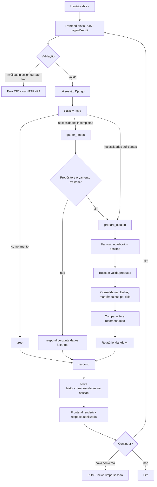

# Fluxo do Usuário

Fluxo real é condicional: agente coleta somente dados ausentes, preserva necessidades na sessão e consulta catálogo quando há propósito e orçamento suficientes. Não há roteiro fixo de quatro perguntas nem promessa de tempo, bateria ou desempenho.

## Comportamento comprovado

- Sem login obrigatório.
- Sessão retém até 50 entradas por 24 horas; LLM recebe até 20 mensagens.
- Mensagem máxima: 4.000 caracteres; rate limit: 10 requisições por sessão em 60 segundos.
- Recarregar mantém dados no backend, mas frontend não busca histórico antigo para exibição.
- Catálogo usa `produtos.json`; `CATALOG_API_URL` é opcional e falhas usam fallback local.
- Especificações podem aparecer na resposta, mas comparação visual, lazy load, três produtos exatos, seminovos e garantias não são garantias do código atual.

## Visualização

Use extensão Mermaid no VS Code ou outro editor compatível.
