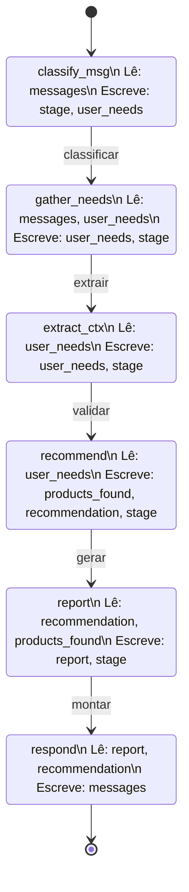

# Módulo 2 — Evolução do Projeto com LangGraph

> Documento de análise e planejamento para discussão em grupo.
> Criado em: 2026-07-16

Trabalho módulo 2 com LangGraph

Grupo Dupla
Gisele Tavares
Wagner Sousa

Slides:
https://gamma.app/docs/Ajuda-Tech-Problema-e-Solucao-r9t5jfg1cwkiv0e

Repositório:
https://github.com/SCTECH-ATIVIDADES/ajuda.tech


---

## 1. Situação Atual do Projeto

### O que já existe

O **Ajuda Tech** é um chatbot com IA (Herbert) que ajuda usuários leigos a escolher o computador ideal. A stack atual é:

- **Backend:** Django 5.x + Python 3.12+
- **LLM:** OpenRouter (DeepSeek V4 Flash)
- **Sessão:** Cookies (sem banco de dados)
- **Frontend:** HTML/CSS/JS vanilla com módulos ES6

### Fluxo atual (simplificado)

```
Usuário digita mensagem
  → POST /send/ com JSON {"message": "..."}
  → Django recupera histórico da sessão (cookie)
  → OpenRouterClient monta: system_prompt + histórico + mensagem
  → Chama API do OpenRouter (1 call)
  → Retorna {"reply": "..."}
  → Frontend renderiza
```

### Limitações do modelo atual

| Limitação | Impacto |
|-----------|---------|
| Call única de LLM por mensagem | Sem raciocínio multi-etapas |
| Histórico em cookie (50 msgs max) | Perde contexto em conversas longas |
| Sem tools/ferramentas | Não busca dados reais de produtos |
| Sem validação entre etapas | Pode gerar recomendações inconsistentes |
| System prompt único e fixo | Mesmo prompt para saudação, coleta e recomendação |

---

## 2. Requisitos do Módulo 2

### Checklist de requisitos

- [ ] Definir um processo real a ser automatizado (objetivo, entrada, etapas, saída)
- [ ] Implementar com LangGraph (estado, nós, conexões)
- [ ] Integrar pelo menos 1 ferramenta (tool)
- [ ] Usar memória/contexto durante execução
- [ ] Registrar prompts em arquivo `.md`
- [ ] Documentar no `README.md` (como funciona, como executar, decisões)
- [ ] Versionado no GitHub com contribuições rastreáveis

### Requisitos detalhados (seção 5.3)

```
Entrada do usuário
  ↓
Preparação do contexto
  ↓
Análise do agente
  ↓
Uso de ferramenta
  ↓
Geração da resposta final
```

### Definição obrigatória do agente

- Objetivo do agente
- Quais entradas recebe
- Quais saídas produz
- Etapas principais que executa
- Por que é considerado um agente

---

## 3. Gap Analysis: Atual vs. Requisitado

| Requisito | Status | Ação necessária |
|-----------|--------|-----------------|
| Processo real automatizado | ✅ | Documentar formalmente |
| Objetivo/entrada/saída | ✅ | Documentar em `docs/AGENTE_LangGraph.md` |
| LangGraph (estado, nós, conexões) | ❌ | **Reescrever backend com LangGraph** |
| Pelo menos 1 tool | ❌ | **Criar tools** (buscar_produtos, gerar_relatorio) |
| Memória/contexto | ⚠️ Parcial | Usar checkpointer do LangGraph |
| Prompts em .md | ⚠️ Parcial | Reorganizar em `docs/PROMPTS_AGENTE.md` |
| Documentar no README | ⚠️ | Atualizar com seção do agente |
| GitHub versionado | ✅ | Manter commits com mensagens claras |

---

## 4. Proposta de Agente

### 4.1 Definição formal

| Campo | Descrição |
|-------|-----------|
| **Nome** | Herbert — Assistente de Escolha de Computador |
| **Objetivo** | Guiar usuários leigos na escolha do computador ideal, coletando necessidades e recomendações personalizadas |
| **Entrada** | Mensagem em linguagem natural do usuário |
| **Saída** | Recomendação estruturada com explicação simples + relatório da recomendação |
| **Por que é agente** | O Herbert decide autonomamente qual etapa executar (coletar dados, recomendar, esclarecer), usa tools para buscar produtos e gerar relatórios, e mantém contexto entre interações |

### 4.2 Fluxo com LangGraph

```
┌──────────────────┐
│      START       │
└────────┬─────────┘
         ▼
┌──────────────────┐
│   classify_msg   │  Classifica: saudação? dados? pergunta?
└────────┬─────────┘
         │
    ┌────┴────┐
    ▼         ▼
┌────────┐ ┌────────────┐
│ greet  │ │gather_needs│  Coleta: propósito, orçamento, mobilidade
└────┬───┘ └─────┬──────┘
     │           ▼
     │    ┌─────────────┐
     │    │extract_ctx   │  Extrai e valida dados coletados
     │    └──────┬──────┘
     │           ▼
     │    ┌─────────────┐
     │    │ recommend    │  ← TOOL: buscar_produtos()
     │    └──────┬──────┘
     │           ▼
     │    ┌─────────────┐
     │    │   report     │  ← TOOL: gerar_relatorio()
     │    └──────┬──────┘
     │           ▼
     │    ┌─────────────┐
     │    │  respond     │  Gera resposta final estruturada
     │    └──────┬──────┘
     │           │
     ▼           ▼
┌──────────────────┐
│       END        │
└──────────────────┘
```

### 4.3 Estado compartilhado

```python
class AgentState(TypedDict):
    messages: Annotated[list, add_messages]
    user_needs: dict
    products_found: list
    stage: str
    recommendation: str
    report: str
```

### 4.4 Nós do grafo

| Nó | Função | Descrição |
|----|--------|-----------|
| `classify_msg` | Classificar mensagem do usuário | Determina se é saudação, pergunta ou dados |
| `gather_needs` | Coletar necessidades | Extrai propósito, orçamento, mobilidade |
| `extract_ctx` | Extrair contexto | Valida e organiza dados coletados |
| `recommend` | Recomendar | Usa tool para buscar produtos e gerar recomendação |
| `report` | Gerar relatório | Monta relatório estruturado da recomendação |
| `respond` | Gerar resposta | Monta resposta final amigável |

---

```
Cada nó recebe o dicionário inteiro, mas só se preocupa com os campos que precisa. O campo stage funciona como o roteador: o nó anterior grava o stage, e o nó seguinte lê ele para decidir se deve executar.

Fluxo visual:

classify_msg → gather_needs → extract_ctx → recommend → report → respond
     │              │              │             │           │          │
  stage: "gather"  stage: "ext"  stage: "rec"  stage: "rpt" stage: "resp"

É basicamente um pipeline sequencial usando o estado como canal de comunicação entre os nós.
```



## 5. Tools a Implementar

### 5.1 Tools definidas

| Tool | Descrição | Tipo |
|------|-----------|------|
| `buscar_produtos` | Busca computadores por categoria e orçamento | Consulta a dados (JSON) |
| `comparar_produtos` | Compara especificações de 2 produtos | Função pura |
| `gerar_relatorio` | Gera relatório estruturado da recomendação | Escrita de relatório |

### 5.2 Base de dados

Criar arquivo `produtos.json` com catálogo de computadores:

```json
[
  {
    "id": 1,
    "nome": "Notebook Dell Inspiron 15",
    "tipo": "notebook",
    "preco": 3299.90,
    "especificacoes": {
      "processador": "Intel Core i5-1235U",
      "ram": "8GB DDR4",
      "armazenamento": "256GB SSD",
      "tela": "15.6'' Full HD"
    },
    "indicado_para": ["estudos", "escritório", "navegador"],
    "mobilidade": "alta"
  }
]
```

### 5.3 Exemplo de tool

```python
@tool
def buscar_produtos(categoria: str, orcamento_max: float) -> str:
    """Busca computadores disponíveis por categoria e orçamento máximo."""
    with open("produtos.json", "r", encoding="utf-8") as f:
        produtos = json.load(f)

    resultados = [
        p for p in produtos
        if p["tipo"] == categoria and p["preco"] <= orcamento_max
    ]

    return json.dumps(resultados, ensure_ascii=False, indent=2)


@tool
def gerar_relatorio(recomendacao: dict) -> str:
    """Gera um relatório em Markdown com a recomendação do computador."""
    relatorio = f"""## Relatório de Recomendação

### Computador Recomendado
- **Nome:** {recomendacao['nome']}
- **Preço:** R$ {recomendacao['preco']:.2f}
- **Tipo:** {recomendacao['tipo']}

### Especificações
{chr(10).join(f"- **{k}:** {v}" for k, v in recomendacao['especificacoes'].items())}

### Indicado para
{', '.join(recomendacao['indicado_para'])}
"""
    return relatorio
```

---

## 6. Estrutura de Arquivos Proposta

```
ajuda.tech/
├── chat/
│   ├── agent/                    # NOVO — Módulo LangGraph
│   │   ├── __init__.py
│   │   ├── state.py             # Estado compartilhado (TypedDict)
│   │   ├── tools.py             # Tools do agente (buscar_produtos, comparar, relatório)
│   │   ├── nodes.py             # Funções de cada nó
│   │   └── graph.py             # Montagem do StateGraph
│   ├── services.py              # ATUALIZAR — integrar LangGraph agent
│   ├── views.py                 # ATUALIZAR — usar novo agent
│   ├── prompts.py               # MANTER — prompts do LLM
│   └── ...
├── produtos.json                # NOVO — Base de dados de produtos
├── docs/
│   ├── AGENTE_LangGraph.md      # NOVO — Definição formal do agente
│   ├── PROMPTS_AGENTE.md        # NOVO — Prompts documentados
│   ├── MODULO2_LANGGRAPH_EVOLUCAO.md  # ESTE ARQUIVO
│   └── ...
├── requirements.txt             # ATUALIZAR — adicionar langgraph
└── README.md                    # ATUALIZAR — seção do agente
```

---

## 7. Dependências Novas

```txt
# Adicionar ao requirements.txt
langgraph>=0.2.0
langchain-core>=0.3.0
```

---

## 8. Documentação Necessária

### 8.1 `docs/AGENTE_LangGraph.md`

Definição formal do agente:
- Objetivo
- Entradas e saídas
- Etapas principais
- Por que é um agente

### 8.2 `docs/PROMPTS_AGENTE.md`

Todos os prompts organizados:
- System prompt do Herbert
- Prompt do nó `classify_msg`
- Prompt do nó `gather_needs`
- Prompt do nó `extract_ctx`
- Prompt do nó `recommend`
- Prompt do nó `report`
- Prompt do nó `respond`

### 8.3 `README.md` (atualização)

Nova seção:
- Como o agente funciona (diagrama)
- Como executar o projeto
- Decisões principais tomadas

---

## 9. Próximos Passos

### Ordem de implementação sugerida

1. Criar estrutura `chat/agent/`
2. Criar `produtos.json` (base de dados)
3. Criar `state.py` (estado compartilhado)
4. Criar `tools.py` (buscar_produtos, comparar_produtos, gerar_relatorio)
5. Criar `nodes.py` (funções de cada nó)
6. Criar `graph.py` (montar o grafo)
7. Integrar com `services.py` e `views.py`
8. Documentar tudo (prompts, agente, README)
9. Testes com `pytest`

### Perguntas para o grupo

- [ ] Qual model LLM usar? (manter DeepSeek ou trocar?)
- [ ] Quantas tools criar no mínimo? (1 basta, mas 3 é mais robusto)
- [ ] Usar checkpointer SQLite ou manter cookie?
- [ ] Criar um agente simples (4 nós) ou mais completo (6+ nós)?
- [ ] Como dividir as tarefas entre integrantes?

---

## 10. Comparativo: Antes vs. Depois

| Aspecto | Antes (atual) | Depois (com LangGraph) |
|---------|--------------|----------------------|
| Arquitetura | Call única de LLM | Grafo com múltiplos nós |
| Estado | Cookie (50 msgs) | LangGraph checkpointer |
| Tools | Nenhuma | buscar_produtos, comparar_produtos, gerar_relatorio |
| Raciocínio | Single-step | Multi-step com conditional edges |
| Modularidade | Tudo junto | Nós separados e testáveis |
| Documentação | Básica | Formal (definição do agente) |

---

*Documento gerado para discussão em grupo. Atualizar conforme decisões forem tomadas.*
